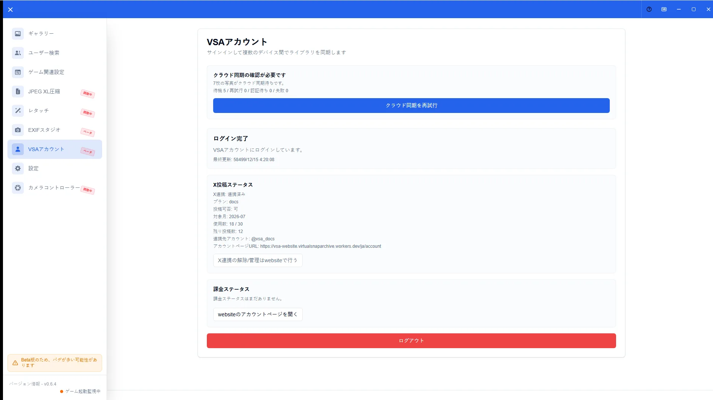
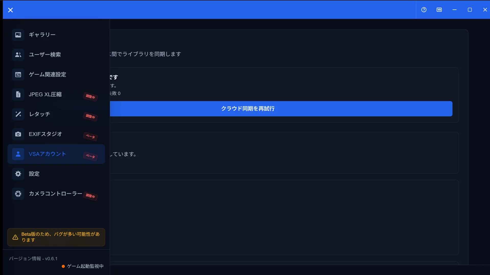

# Account Guide

[🏠 Document Top](../index.md) | [⚖️ Terms of Service](./terms.md) | [🔒 Privacy Policy](./privacy.md)

---

## Overview

The Account screen shows VSA account state, cloud save, and X posting status. Sign-in happens on the **VSA website**; the app syncs and displays that state.

Cloud save, share links, and X posting are under **staged rollout**. If a menu is missing, it may not be available in your environment yet.

## How to open

1. Open **Account** in the sidebar
2. If signed out, follow prompts such as **Sign in on the website**
3. After login, review cloud and X status

## Main operations

### Account overview

Check login state, plan, and links to the website account page.

### Cloud save status

When available, review cloud save enablement and sync status.

### X posting status

Review plan and remaining monthly posts. Unlink or manage X on the website account page.

## Notes

- Local gallery and favorites do not require an account
- Outside rollout, cloud or X UI may be hidden
- Pricing and limits follow in-app display and the [Terms of Service](terms.md)
- Related: [X Posting Guide](x-post-guide.md), [Favorites Guide](favorites-guide.md), [Cloud and Account Integration](google-integration.md)
