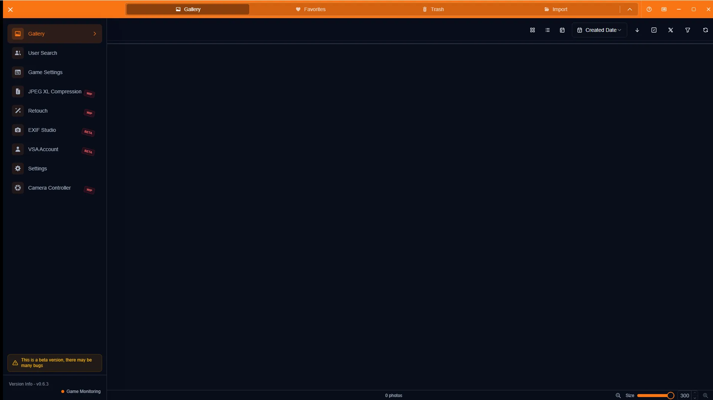
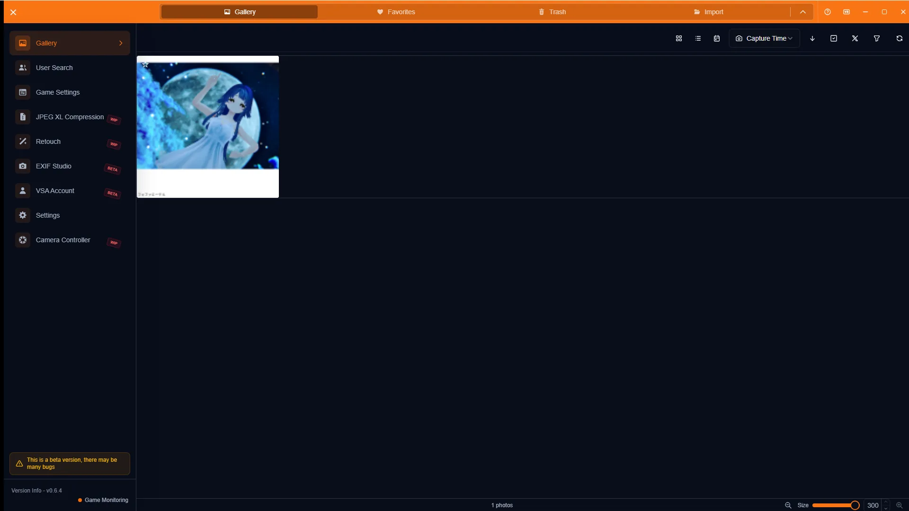
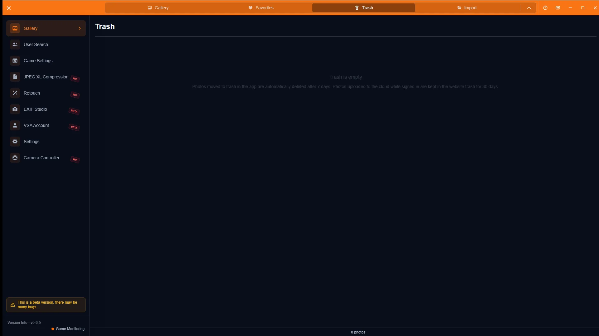

# Gallery Guide

[🏠 Document Top](../index.md) | [⚖️ Terms of Service](./terms.md) | [🔒 Privacy Policy](./privacy.md)

---

## Overview

The gallery lets you browse imported photos, sort them, mark favorites, inspect details, and manage the trash. You can switch between grid and table views.

> **Note (Integral support)**
> Integral support is still in progress. Some camera parameters may not be recorded or shown correctly.

## How to open

1. Open **Gallery** in the sidebar
2. Use the top tabs for **Gallery**, **Favorites**, and **Trash**
3. Use the toolbar for view mode, sorting, and selection mode

## Main operations

### Browse and details

Click a photo to open the detail sidebar with world name, photographer, participants, and camera info.

### Sort and favorites

Sort from the toolbar (created date, world name, file name, size, capture time, photographer, and more). Toggle ascending/descending with the arrow control. Use the star icon on thumbnails or in details to favorite a photo.

### Trash

Photos removed from the gallery move to the Trash tab. You can restore them, permanently delete them, or empty the trash.

### Other operations

- Switch grid/table view; zoom thumbnails with `Ctrl` + `=` / `-` or the slider
- Selection mode for bulk favorites or trash moves
- X post mode (up to 4 photos); see the [X Posting Guide](x-post-guide.md)
- Click a username in details to open [Person Search](person-search-guide.md)

## Notes

- Permanent delete from trash cannot be undone (Windows Recycle Bin may still allow recovery)
- Cloud save for favorites is under staged rollout; see the [Favorites Guide](favorites-guide.md)
- Integral-related values may be incomplete
