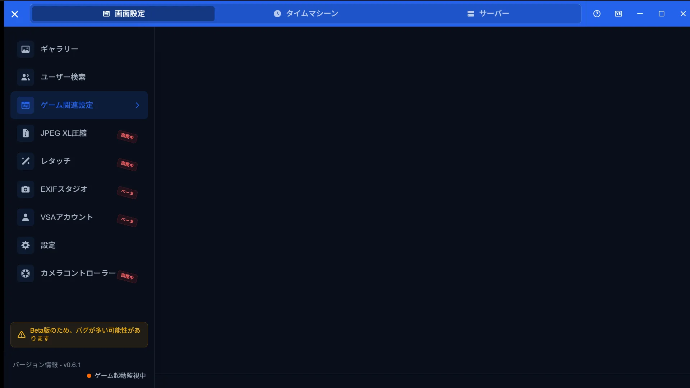
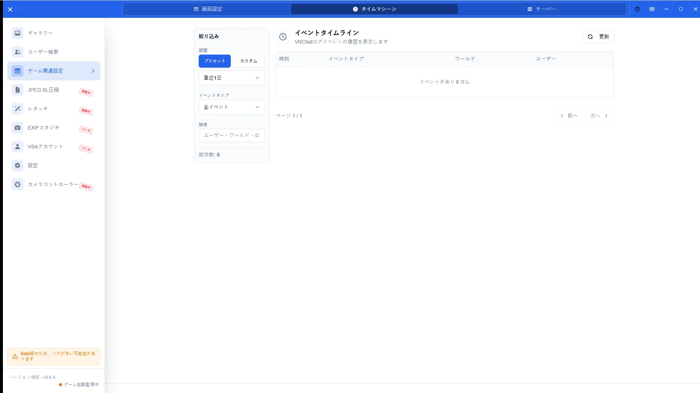
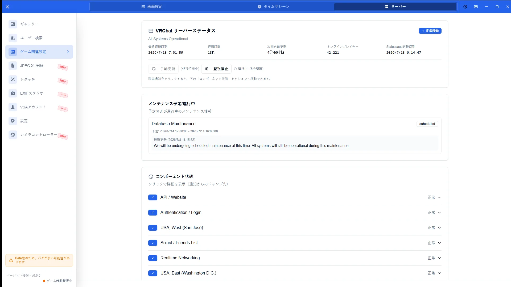

# Game Config Guide

[🏠 Document Top](../index.md) | [⚖️ Terms of Service](./terms.md) | [🔒 Privacy Policy](./privacy.md)

---

## Overview

Game Config covers VRChat photo watching, folder/OSC settings, Time Machine (instance history), and server status. Switch tabs at the top of the screen.

> **Note (Integral support)**
> Integral support is still in progress. Some camera parameters may not be recorded or shown correctly.

## How to open

1. Open **Game Config** in the sidebar
2. Switch among **Settings**, **Time Machine**, and **Server**
3. Some of the same options are also under **Settings > Game**

## Main operations

### Settings

Toggle watching, set screenshot/metadata/log folders, and configure OSC. Save after changes.

### Time Machine

Review past instance history and rejoin when available.

### Server status

Check VRChat server availability and maintenance information. Use **Open official details** to open the relevant incident or the VRChat status page in your browser.

## Notes

- A wrong watch folder means photos will not be imported
- Incorrect OSC settings break controller linking
- Server status may use external network requests
- For reading metadata, see [VRChat Integration](vrchat-integration.md)
