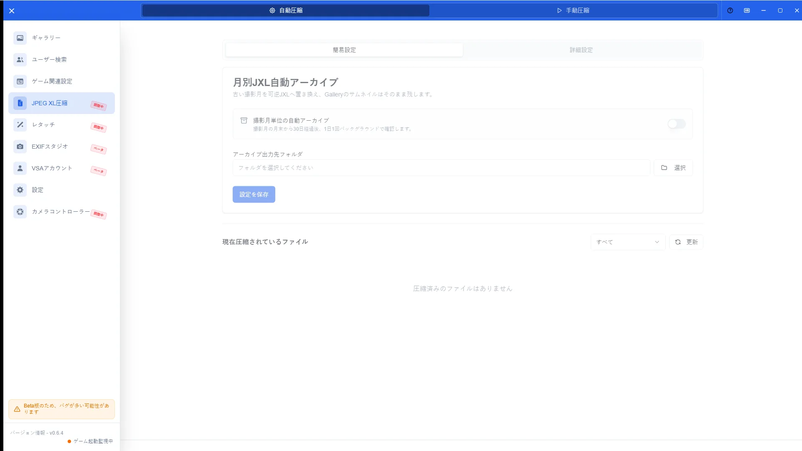
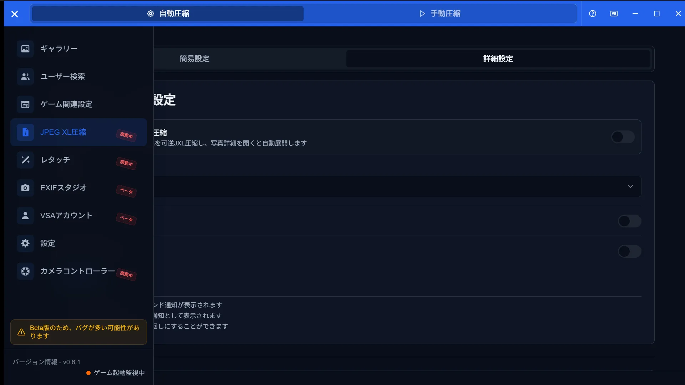

# JXL Compression Guide

[🏠 Document Top](../index.md) | [⚖️ Terms of Service](./terms.md) | [🔒 Privacy Policy](./privacy.md)

---

## Overview

JPEG XL (JXL) compression stores photos in a smaller format. Simple and detailed modes are available, including automatic compression schedules.

## How to open

1. Open **JXL Compression** in the sidebar
2. Switch between simple and detailed views
3. Review automatic and manual compression options

## Main operations

### Simple mode

Use fewer controls for common compression settings. Start here if you are new to JXL.

### Detailed mode

Tune quality, schedule, and background processing in more detail.

## Notes

- Compression increases disk I/O; pausing while VRChat is running may be available
- Whether originals are replaced or kept aside follows on-screen settings
- Related toggles may also appear under **Settings > System**
