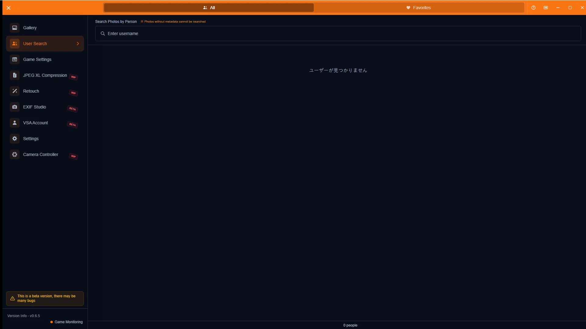
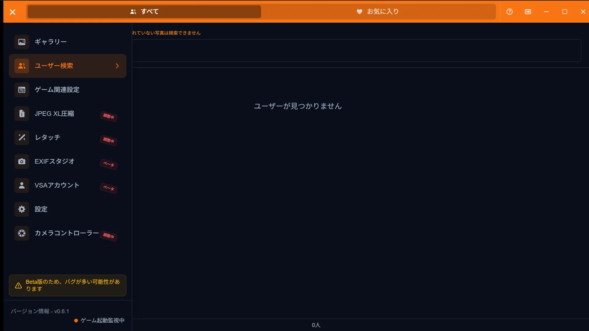
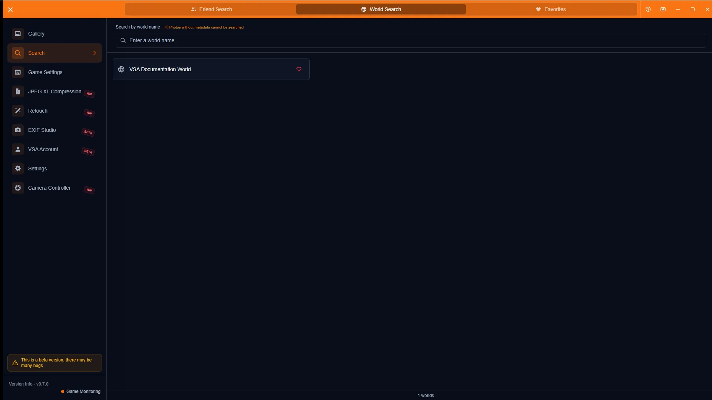
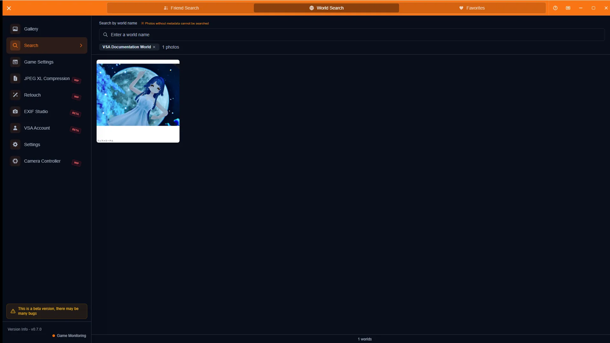
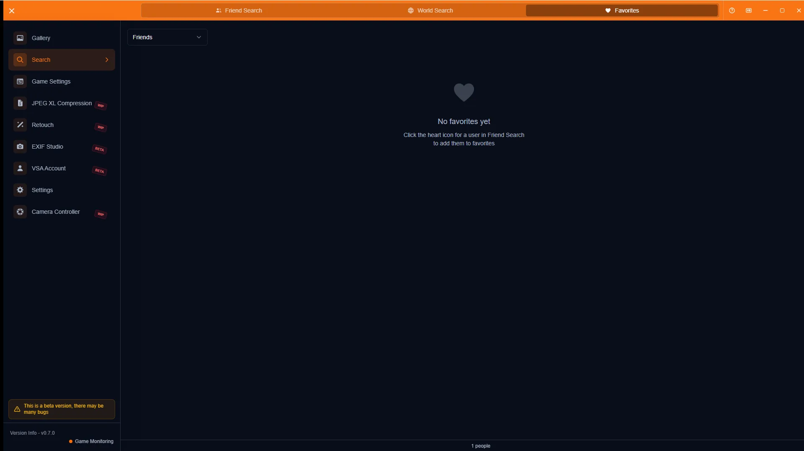
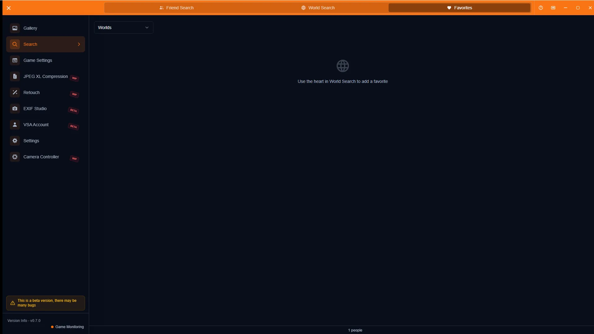

# Search Guide

[🏠 Document Top](../index.md) | [⚖️ Terms of Service](./terms.md) | [🔒 Privacy Policy](./privacy.md)

---

## Overview

The Search screen filters photos by friends who appear in them or by world name. Use the title bar tabs to switch between Friend Search, World Search, and Favorites. Photos need VRChat metadata.

## How to open

1. Open **Search** in the sidebar
2. Or click a username in the gallery detail participant list (opens Friend Search)

## Main operations

### Friend search

Type a username in the search bar and add a candidate as a tag. With no selection, the user directory is shown.

Matching photos appear as a grid. Adding multiple users narrows results to photos that include all of them (AND search). Click a photo for details.

### World search

Filter the world list by name, then select a world to show photos taken there. Use the heart icon to favorite a world.

### Favorites

Items favorited from Friend Search or World Search appear here. Switch the kind select between Friends and Worlds. Click a card to jump to the matching search results.

## Notes

- Photos without metadata are not searchable. Check watch folders and metadata output in [Game Config](game-config.md) and [VRChat Integration](vrchat-integration.md)
- Romaji matching may be available, but naming variants can miss results
- Available users depend on how much metadata you have imported
