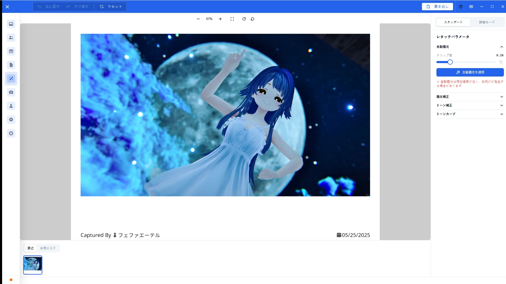
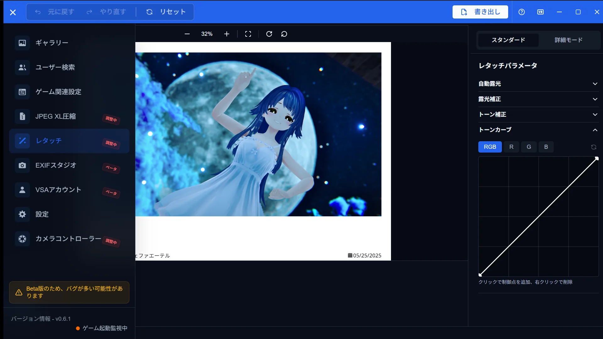
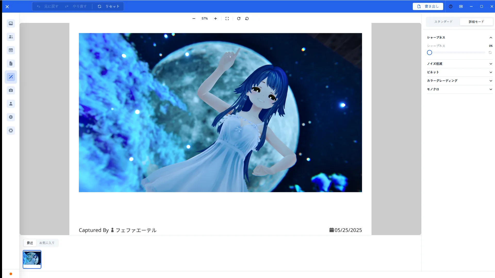

# Retouch Guide

[🏠 Document Top](../index.md) | [⚖️ Terms of Service](./terms.md) | [🔒 Privacy Policy](./privacy.md)

---

## Overview

Retouch adjusts brightness, tone, and exposure parameters for gallery photos inside the app. The main tools are auto exposure, tone curve, and individual parameters.

## How to open

1. Select a photo in the gallery
2. Open **Retouch**
3. Adjust in the right panel and export when needed

## Main operations

### Auto exposure

Use auto exposure to balance overall brightness, then fine-tune manually.

### Tone curve

Use the tone curve for finer highlight / midtone / shadow control.

### Parameter adjustments

Adjust brightness, contrast, saturation, color temperature, highlights, shadows, and more with sliders. Each control can be reset.

## Notes

- Follow on-screen guidance for save/export destinations
- Prefer not overwriting originals
- Zoom shortcuts are listed in [Keyboard Shortcuts](keyboard-shortcuts.md)
