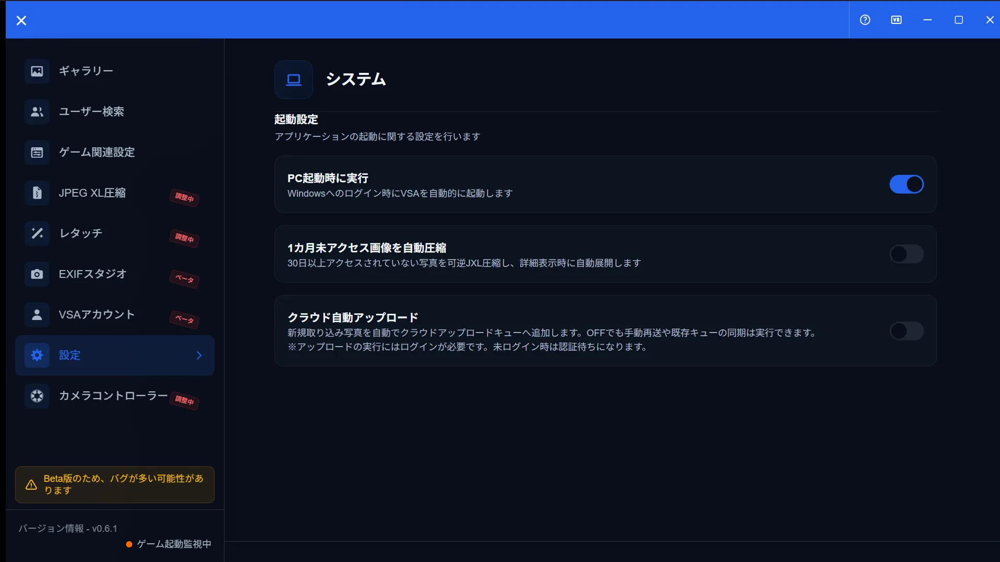
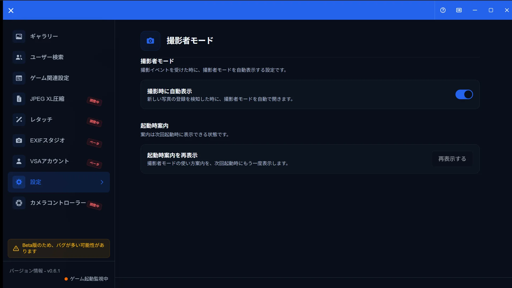
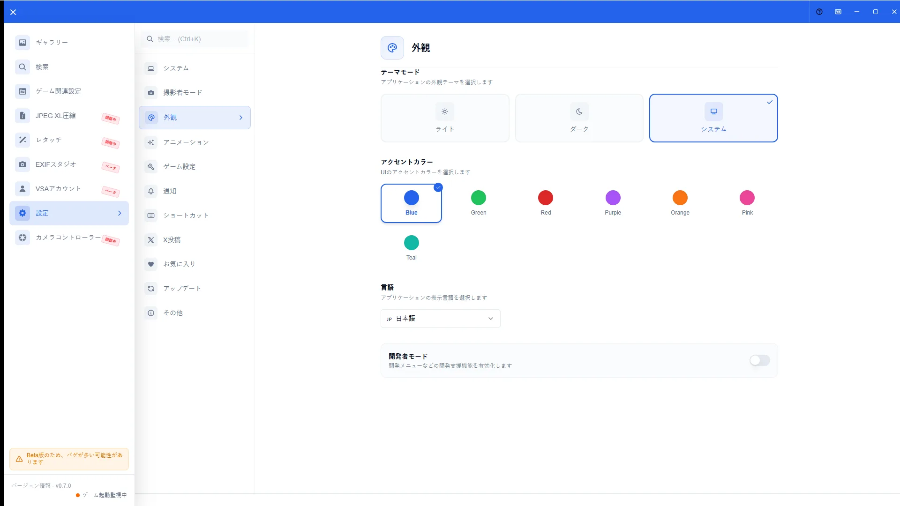
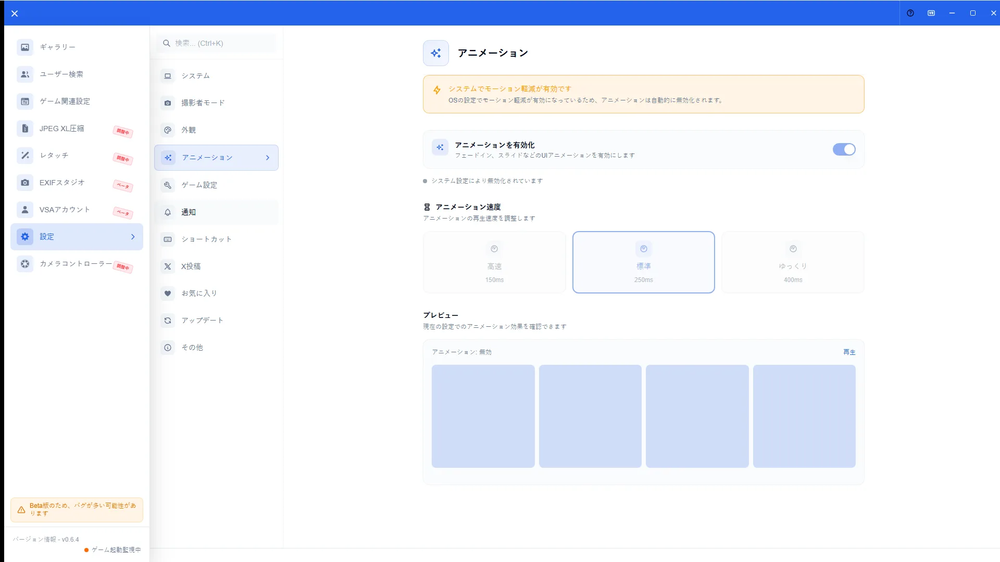
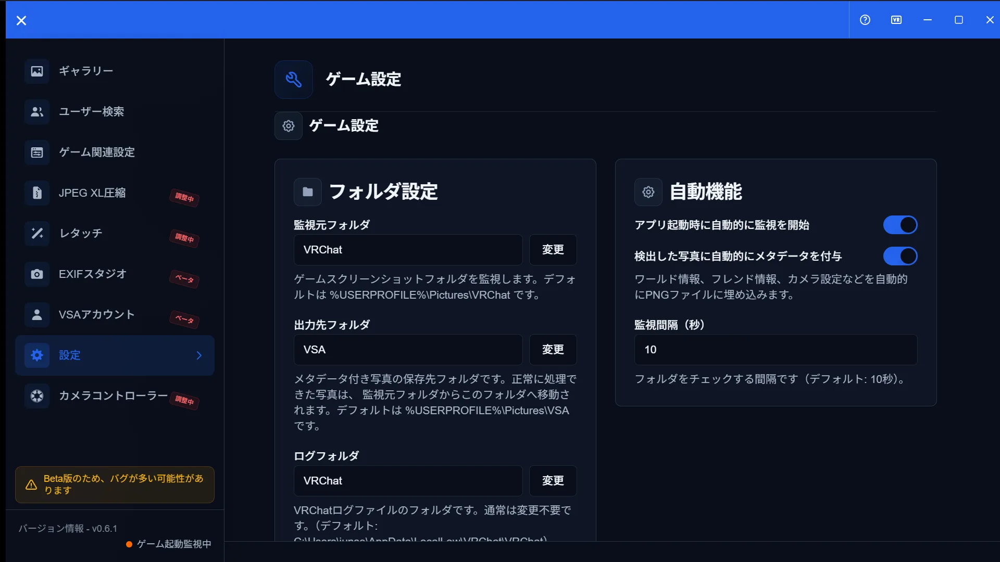
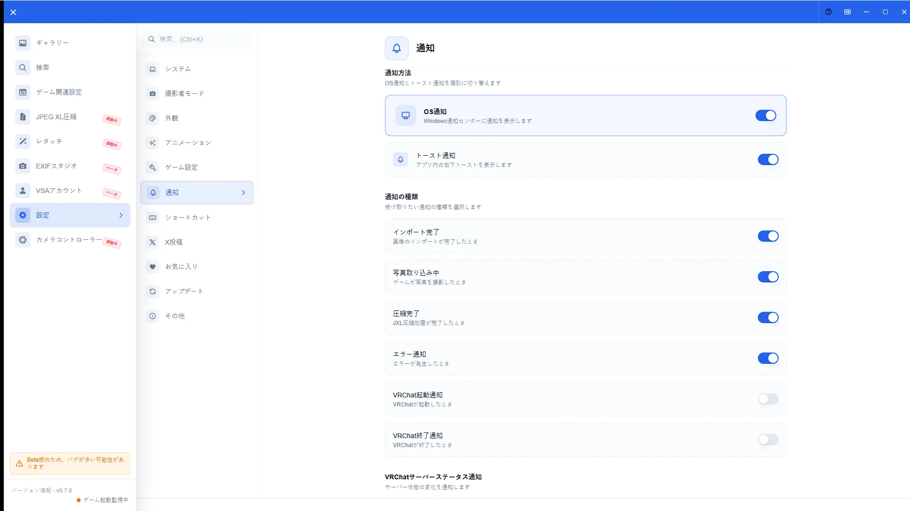
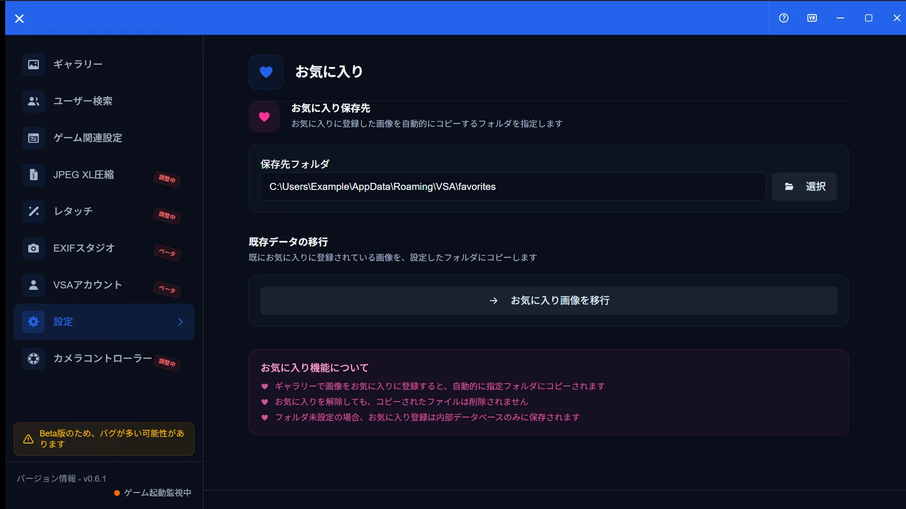
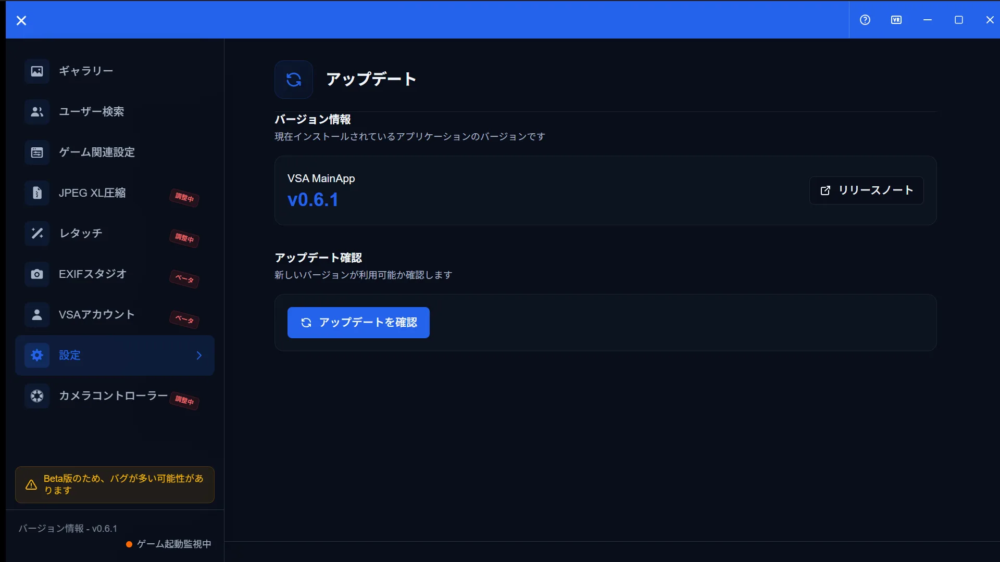
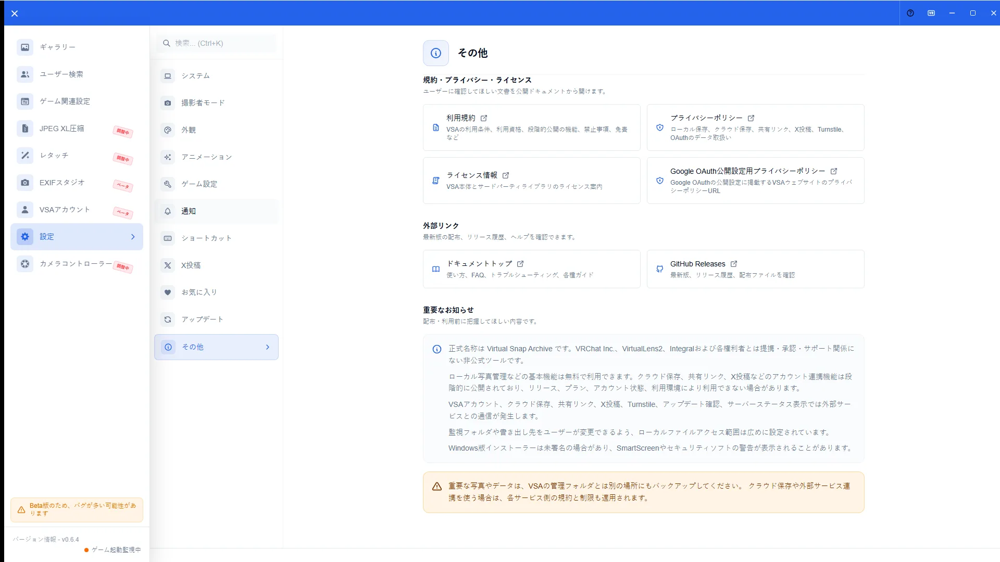

# Settings Guide

[🏠 Document Top](../index.md) | [⚖️ Terms of Service](./terms.md) | [🔒 Privacy Policy](./privacy.md)

---

## Overview

Settings adjust startup, appearance, notifications, shortcuts, game linking, X post presets, and more, one panel at a time. Switch panels from the left menu.

Panels covered: System, Photographer Mode, Appearance, Animation, Game, Notification, Shortcut, Favorites, X Post, Update, Other.

## How to open

1. Open the gear icon at the bottom of the sidebar
2. Choose a panel from the left menu
3. Most changes save immediately

## Main operations

### System

Configure autostart, automatic compression, and cloud sync (when shown).

### Photographer Mode

Enable photographer mode, auto-show on capture, and re-show the startup hint.

### Appearance

Set theme (light / dark / system), accent color (7 colors: blue / green / red / purple / orange / pink / teal), language, and developer mode.

### Animation

Toggle animations and choose speed (fast / normal / slow). OS reduced-motion settings disable animations automatically.

### Game

Review and change watch folders, OSC, and related game linking options. See also [Game Config](game-config.md).

### Notification

Toggle OS notifications and toast notifications separately, plus per-type alerts and notification sound.

### Shortcut

Review and reassign keyboard shortcuts. Details: [Keyboard Shortcuts](keyboard-shortcuts.md).

### Favorites

Manage favorites data, migration, and cloud-related options when shown.

### X Post

Add, edit, or delete text-template presets. X account auth is not done here (website side).

### Update

Check the current version, release notes, and update availability.

### Other

Open Terms, Privacy Policy, License, GitHub Releases, **Document Top**, and important notices.

## Notes

- There is no File panel or VDI panel in the current UI
- Cloud / X items may be hidden depending on rollout
- Open docs from **Settings > Other > Document Top**
