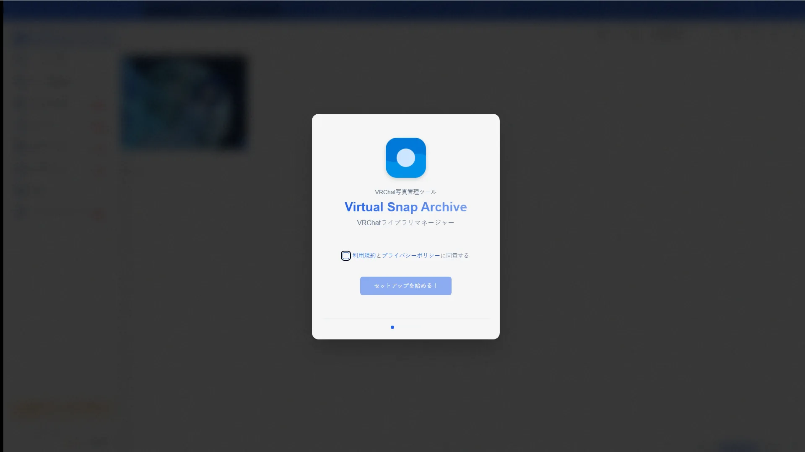
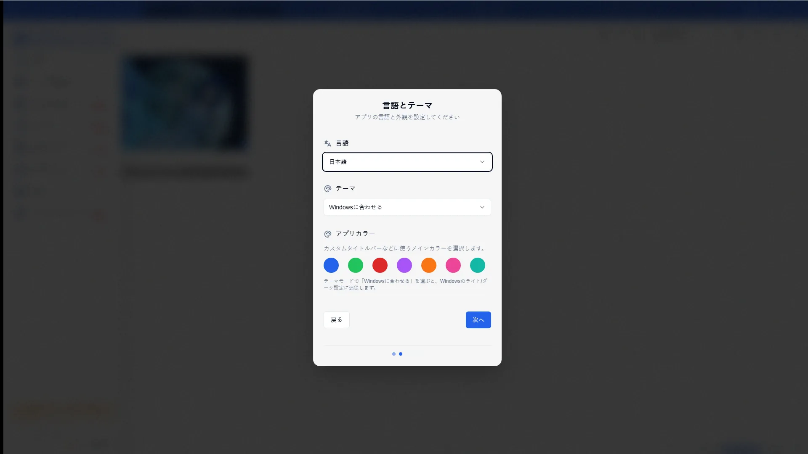
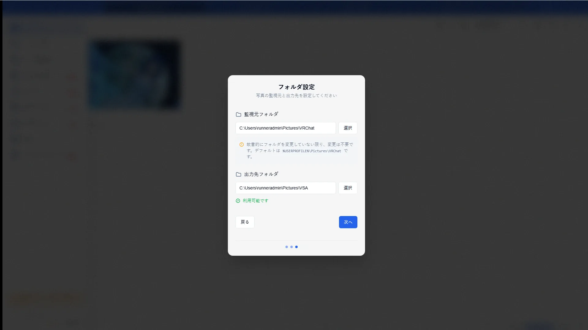
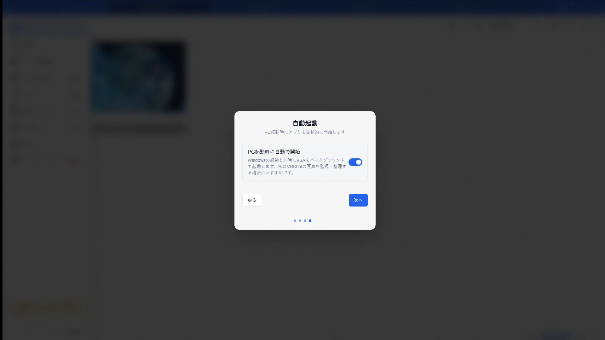
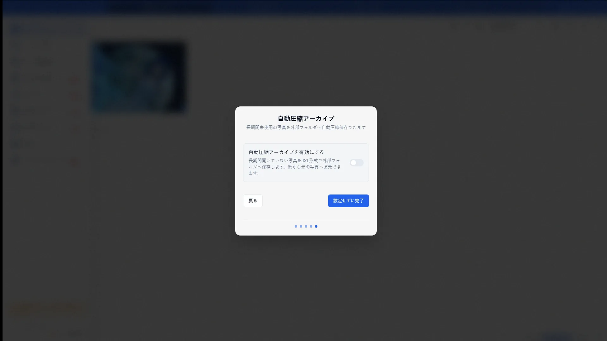

# Setup Wizard Guide

[🏠 Document Top](../index.md) | [⚖️ Terms of Service](./terms.md) | [🔒 Privacy Policy](./privacy.md)

---

## Overview

On first launch, the setup wizard guides you through language/theme, watch folders, autostart, and archive compression. You can skip and finish later.

## How to open

1. Launch VSA for the first time (or after settings are reset)
2. Follow the wizard steps
3. After completion, the main app opens

Change the same options later from Settings or Game Config.

## Main operations

### Welcome

Product intro with Next / Skip.

### Language and theme

Choose the display language and theme.

### Folder settings

Set paths such as the screenshot watch folder used for import.

### Autostart

Configure startup options such as launching with the OS.

### Archive compression

Configure initial JPEG XL / archive compression options.

## Notes

- Skipping is fine; the same options remain available in Settings
- Without a watch folder, photos will not be imported
- For compression details, see [JXL Compression](jxl-compression.md)
