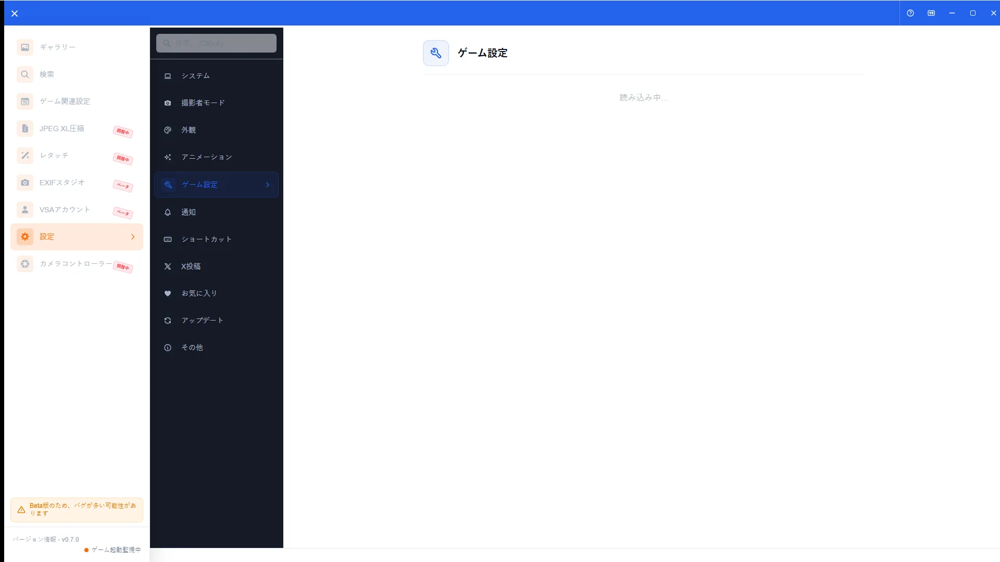
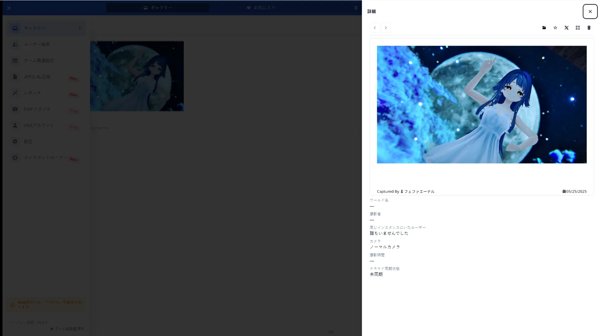

# VRChat Integration

[🏠 Document Top](../index.md) | [⚖️ Terms of Service](./terms.md) | [🔒 Privacy Policy](./privacy.md)

---

## Overview

VSA reads world, user, and camera metadata from VRChat screenshots and shows it in gallery details. Watch folders and OSC settings are configured in Game Config / Settings.

> **Note (Integral support)**
> Integral support is still in progress. Some camera parameters may not be recorded or shown correctly.

## How to open

1. Open **Game Config** in the sidebar, or **Settings > Game**
2. Confirm watch folder, metadata output, and OSC
3. Open a photo in the gallery and check VRChat info in the detail sidebar

## Main operations

### Settings-side metadata linking

Configure the watch folder, metadata output path, and OSC so screenshots are detected automatically.

### Photo detail metadata

Photo details show world name, photographer, participants, camera type, and parameters.

## Notes

- VSA is an unofficial tool and is not affiliated with or endorsed by VRChat Inc. or camera authors
- Photos without metadata (older PNGs, unwatched folders) show empty detail fields
- For folder setup details, see [Game Config](game-config.md)
