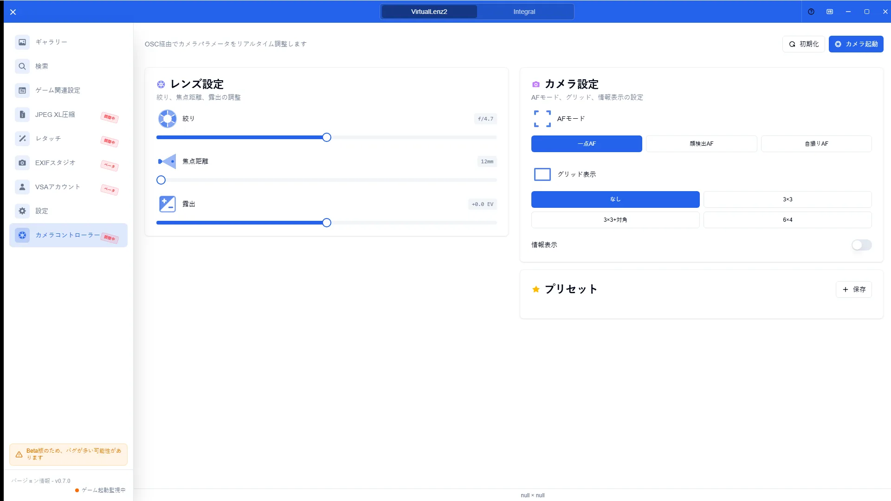
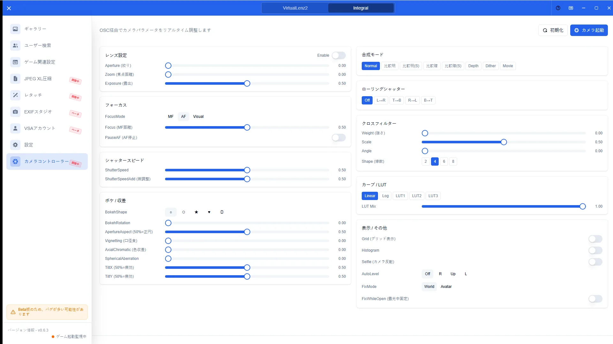

# VirtualLens Controllerガイド

[🏠 ドキュメントトップ](../index.md) | [⚖️ 利用規約](./terms.md) | [🔒 プライバシーポリシー](./privacy.md)

---

## 概要

VirtualLens Controllerは、OSC経由でVirtualLens2のカメラパラメータをリアルタイム操作する画面です。焦点距離、絞り、露出などをスライダーで調整し、プリセットとして保存できます。

## 開き方

1. サイドバーの「コントローラー」を開く
2. VRChat側でVirtualLens2とOSCが有効であることを確認する
3. 必要に応じて[ゲーム側設定](game-config.md)でOSC設定を確認する

## 主な操作

### 画面概要

コントローラー画面ではパラメータ一覧、プリセット、OSC状態を確認できます。

### ライブ操作

スライダーや数値入力でパラメータを変更すると、接続中はVRChat側へ反映されます。よく使う組み合わせはプリセットとして保存・読み込みできます。

## 注意点

- OSC未接続やポート不一致のときは操作が反映されません
- VirtualLens2以外のカメラでは想定どおり動作しない場合があります
- VSAはVirtualLens2および権利者と提携・承認関係にない非公式ツールです
