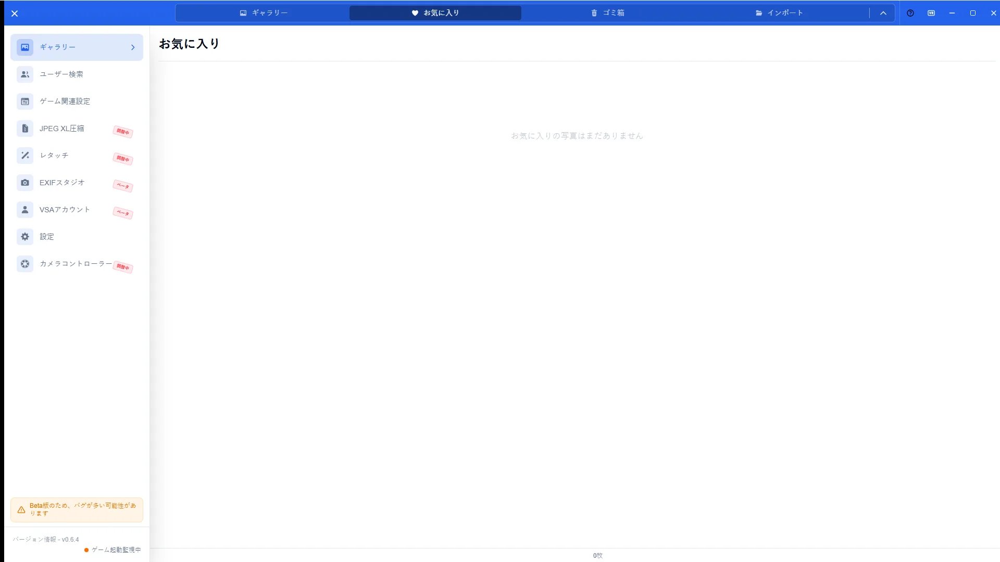
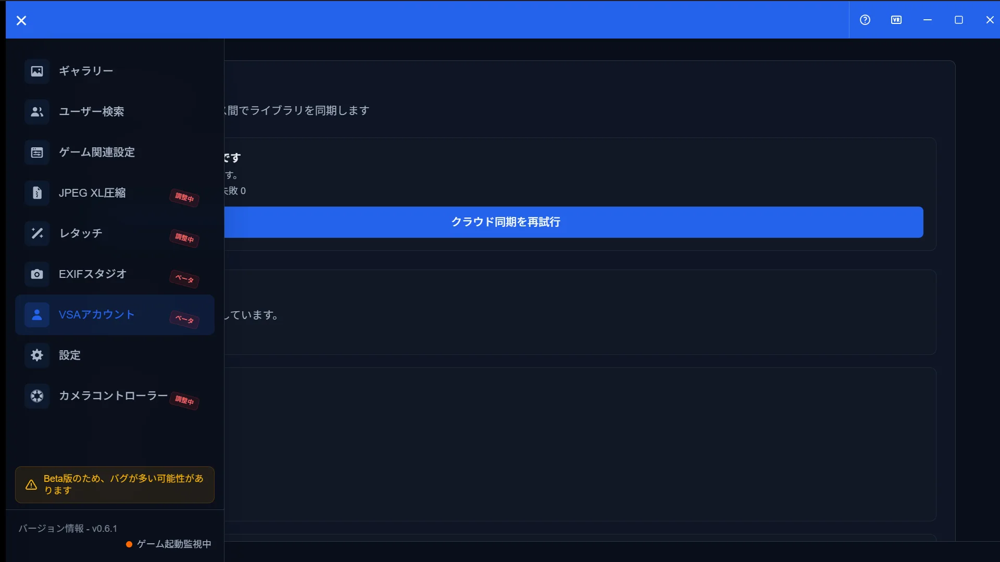

# お気に入り機能ガイド

[🏠 ドキュメントトップ](../index.md) | [⚖️ 利用規約](./terms.md) | [🔒 プライバシーポリシー](./privacy.md)

---

## 概要

お気に入りは、写真に星を付けてローカルで素早く見返す機能です。クラウド保存が有効な環境では、お気に入りのバックアップも利用できる場合があります（段階的ロールアウト）。

## 開き方

1. ギャラリーで星アイコンをクリックしてお気に入り登録する
2. 上部タブの「お気に入り」を開く
3. クラウド関連はアカウント画面または設定のお気に入りパネルで確認する

## 主な操作

### お気に入り一覧

お気に入りタブで登録済み写真を一覧表示します。ギャラリーと同様に詳細表示や選択操作ができます。

### クラウド同期（ロールアウト）

利用可能な環境では、クラウド保存の状態を確認できます。表示されない場合は未公開環境です。

## 注意点

- ローカルのお気に入りはアカウントなしでも使えます
- クラウド保存は公開状況・プラン・アカウント状態に依存します
- 設定パネル側の移行や管理は[設定ガイド](settings-guide.md)を参照してください
