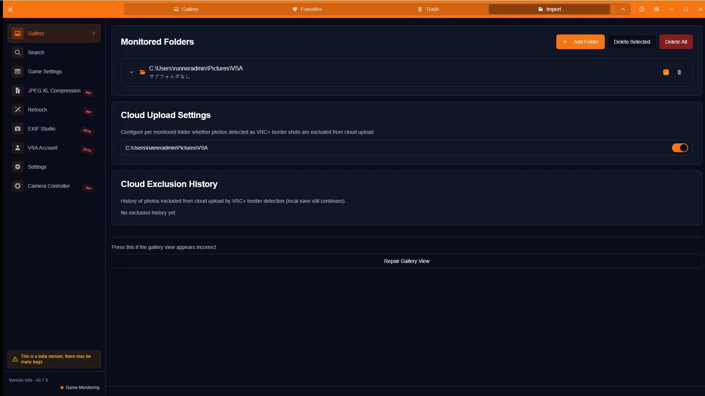

# ギャラリー操作ガイド

[🏠 ドキュメントトップ](../index.md) | [⚖️ 利用規約](./terms.md) | [🔒 プライバシーポリシー](./privacy.md)

---

## 概要

ギャラリーでは、取り込んだ写真の一覧表示、ソート、お気に入り、詳細確認、ゴミ箱操作ができます。グリッド表示とテーブル表示を切り替えられます。

> **注意（Integral対応状況）**
> Integral対応は進行中です。一部のカメラパラメータが正しく記録・表示されない場合があります。

## 開き方

1. サイドバーの「ギャラリー」を開く
2. 上部タブで「ギャラリー」「お気に入り」「ゴミ箱」「インポート」を切り替える
3. ツールバーで表示モード、ソート、選択モードを操作する

## 主な操作

### 一覧と詳細

写真をクリックすると右側に詳細サイドバーが開き、ワールド名・撮影者・参加者・カメラ情報などを確認できます。

### ソートとお気に入り

ツールバーのソート項目（作成日、ワールド名、ファイル名、サイズ、撮影日時、撮影者など）で並べ替え、矢印で昇順/降順を切り替えます。サムネイルや詳細の星アイコンでお気に入り登録できます。

### ゴミ箱

ギャラリーから削除した写真はゴミ箱タブに移ります。復元、完全削除、ゴミ箱を空にする操作ができます。

### インポート

監視フォルダの登録・有効化や取り込み状況を確認します。写真が自動で入らない場合は、まずこのタブを確認してください。

### その他の操作

- グリッド/テーブル表示の切り替え、サムネイルズーム（`Ctrl` + `=` / `-`、またはスライダー）
- 選択モードでの一括お気に入り・一括ゴミ箱移動
- X投稿モード（最大4枚）からの投稿（詳細は[X投稿機能ガイド](x-post-guide.md)）
- 詳細サイドバーのユーザー名クリックで[検索](person-search-guide.md)へ遷移

## 注意点

- ゴミ箱からの完全削除は取り消せません（システムのゴミ箱経由で復元できる場合はあります）
- お気に入りのクラウド保存は段階的ロールアウト対象です。詳細は[お気に入りガイド](favorites-guide.md)
- Integral関連の数値は未対応・不完全な場合があります
