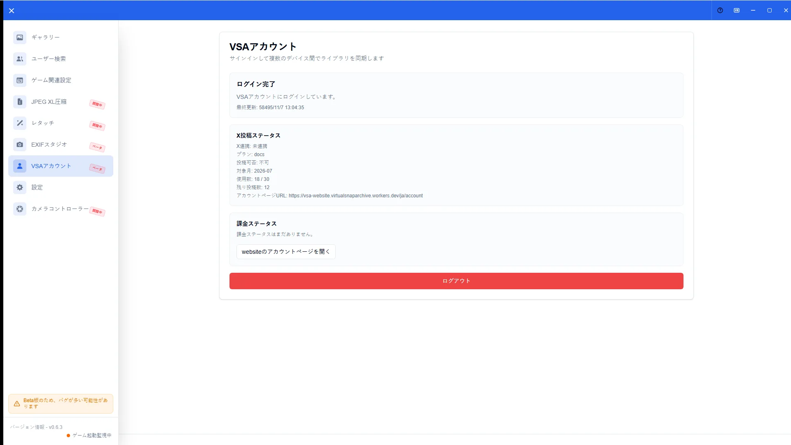

# クラウド・アカウント連携

[🏠 ドキュメントトップ](../index.md) | [⚖️ 利用規約](./terms.md) | [🔒 プライバシーポリシー](./privacy.md)

---

## 概要

VSAのクラウド保存、共有リンク、X投稿などのアカウント連携機能は、**段階的ロールアウト**で公開されます。本ガイドはロールアウト全体の概要のみを扱います。具体的な操作はアプリ内表示と関連ガイドを正とします。

## 開き方

1. サイドバーの「アカウント」を開く
2. ロールアウト状態や利用可否の案内を確認する
3. サインインが必要な場合はVSAウェブサイトの案内に従う

## 主な操作

### ロールアウト状況の確認

アカウント画面で、連携機能の公開状況や利用可否の概要を確認します。表示内容は環境により異なります。

利用できる場合の詳細は次を参照してください。

- [アカウントガイド](account-guide.md)
- [お気に入りガイド](favorites-guide.md)
- [X投稿機能ガイド](x-post-guide.md)

## 注意点

- 以前の「Google連携」向け詳細手順は現行の公開範囲と一致しないため、本ガイドでは扱いません
- UIが出ない機能は、その環境では未提供です
- 規約・データの扱いは[利用規約](terms.md)と[プライバシーポリシー](privacy.md)が正本です
