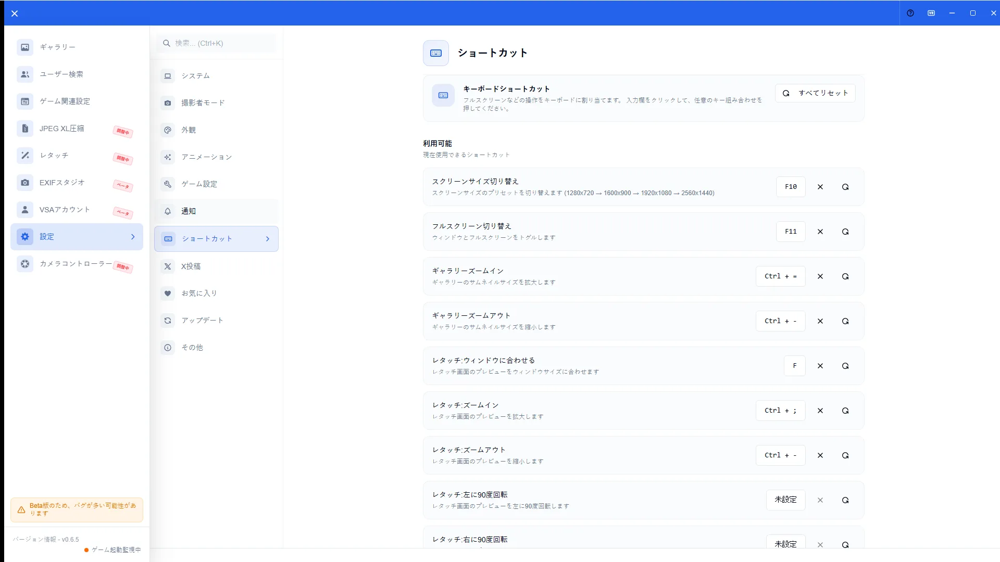
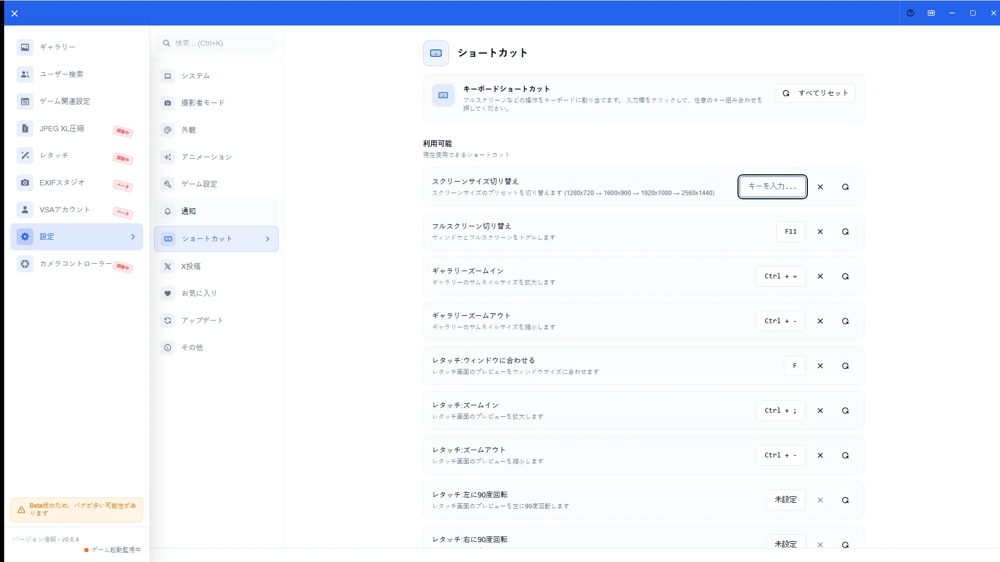

# キーボードショートカット一覧

[🏠 ドキュメントトップ](../index.md) | [⚖️ 利用規約](./terms.md) | [🔒 プライバシーポリシー](./privacy.md)

---

## 概要

VSAのキーボードショートカットは設定のショートカットパネルで確認・変更できます。表示サイズ、フルスクリーン、ギャラリー／レタッチのズームなどが対象です。

## 開き方

1. 「設定 > ショートカット」を開く
2. 一覧から変更したい行を選ぶ
3. 新しいキー組み合わせを入力して保存する

## 主な操作

### ショートカット一覧

設定パネルで現在の割り当てを確認します。代表例:

| 操作 | デフォルト |
|------|------------|
| スクリーンサイズ切り替え | `F10` |
| フルスクリーン切り替え | `F11` |
| ギャラリーズームイン | `Ctrl` + `=` |
| ギャラリーズームアウト | `Ctrl` + `-` |

### カスタマイズ

行をクリックしてキー入力待ちにし、新しい組み合わせを登録します。デフォルトへ戻す操作もパネルから行えます。

## 注意点

- OSや他アプリのショートカットと競合する場合があります
- ギャラリー用とレタッチ用など、画面ごとに有効なショートカットが異なります
- 変更後も効かない場合はフォーカスが入力欄にないか確認してください
