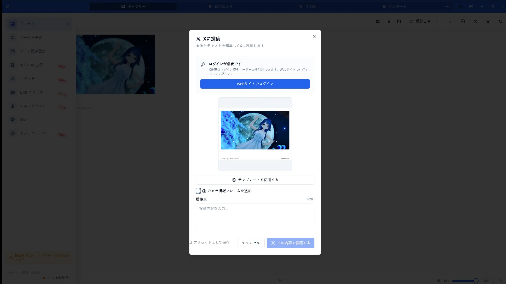
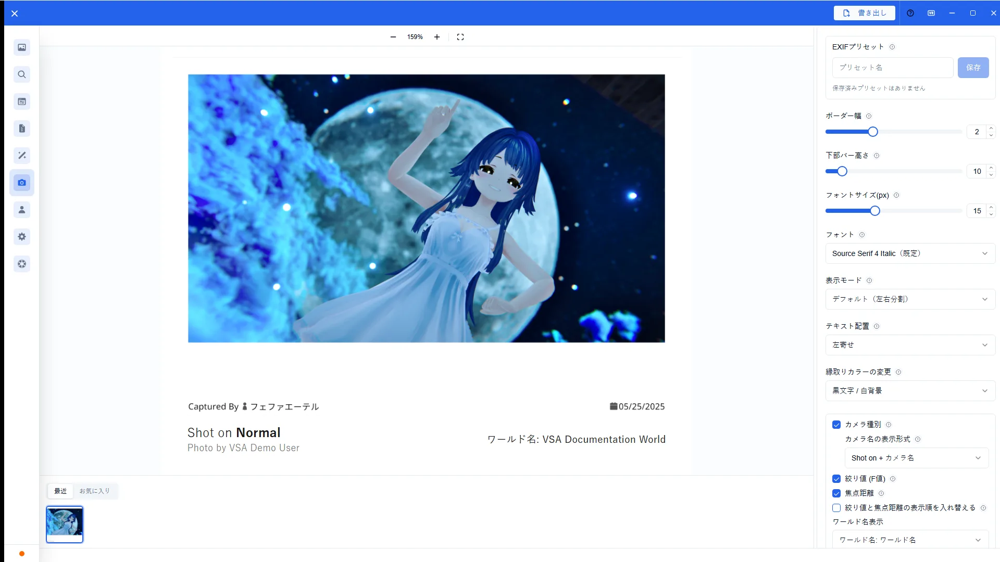
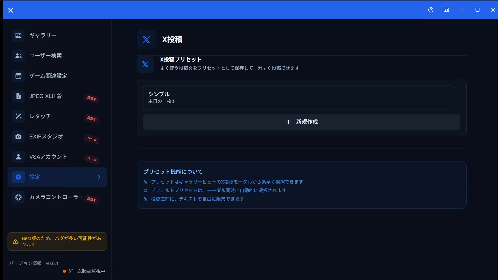

# X投稿機能ガイド

[🏠 ドキュメントトップ](../index.md) | [⚖️ 利用規約](./terms.md) | [🔒 プライバシーポリシー](./privacy.md)

---

## 概要

X投稿機能では、ギャラリーやお気に入りから選んだ写真（最大4枚）を投稿モーダルで編集し、カメラ情報フレーム付きでXへ投稿できます。投稿テキストのプリセットは設定パネルで管理します。

X連携と投稿は**段階的ロールアウト**対象です。利用可否は公開状況、プラン、アカウント状態、利用環境により異なります。

## 開き方

1. VSAウェブサイトでアカウントにログインし、必要に応じてX連携を行う
2. アプリのアカウント画面でログイン状態とX投稿ステータスを確認する
3. ギャラリー／お気に入りで写真を選び、「X に投稿」またはX投稿モードからモーダルを開く
4. プリセット管理は「設定 > X投稿」を開く

## 主な操作

### 投稿モーダル

テキスト入力、プリセット適用、写真の確認、投稿実行を行います。

### カメラ情報フレーム

投稿前にカメラ情報フレームの有無や見た目を確認できます。フレーム付き画像を投稿に含められます。

### 設定のプリセット

設定のX投稿パネルで、投稿テキストテンプレートなどのプリセットを追加・編集・削除できます。アプリ内でのX OAuth認証フローはありません。

### アカウントのXステータス

アカウント画面では、プランや月間の投稿残数などX投稿ステータスを確認できます。X連携の解除・管理はウェブサイトのアカウントページから行います。

## 注意点

- アプリ設定からの旧OAuth認証手順は廃止されています。ログインとX連携はウェブサイト側が正です
- ロールアウト対象外の環境では、投稿ボタンやステータスが表示されないことがあります
- 投稿上限・料金はアプリ内表示と[利用規約](terms.md)に従います
- 関連: [アカウントガイド](account-guide.md)、[設定ガイド](settings-guide.md)
